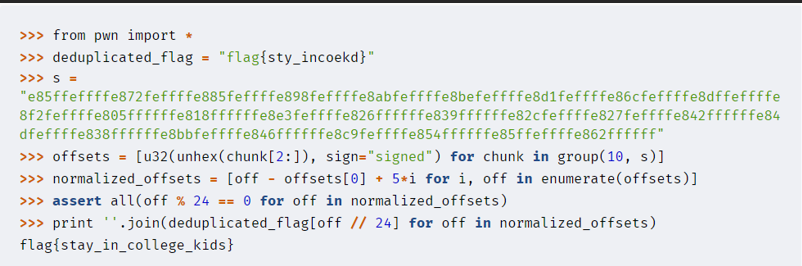

Title: "Stripped to the Core"

Description: Welcome to "Stripped to the Core," a challenging forensics and reversing CTF challenge. You'll be tasked with recovering a flag from a stripped binary file. The file has been ruthlessly stripped of its sections, leaving it with a bare minimum of information. The flag is hidden somewhere within the file, but you'll need to use your forensics and reversing skills to uncover it.

Hints:
Start by analyzing the stripped binary file to see what information you can gather.
Look for any strings or other data that may give you clues to the flag.

Flag: flag{stay_in_college_kids}

Write Up:
We are provided with a core dump. Examining the flavor-text and the dump, we notice that the dump has no null bytes; we assume that they have been stripped out.
Then we examine the hexdump and look for any clues. One thing that jumps out is that there are some regular striped patterns that become vertically aligned if you display 20 bytes in each line. Once we do that, we notice the following section.

The ASCII characters ' flag{sty_incoekd} '  can be read down a column. Closer examination show that no characters have been duplicated with only the first occurrence of each character preserved.
If we normalize the fixed offsets against their start, we see that all the distances are multiples of 24, so this also confirms that each chunk was originally 24 bytes before the null bytes were removed.
Dividing and indexing tells us which characters were used in each of the invoked function calls, which is the flag

Points: 300 (Hard)