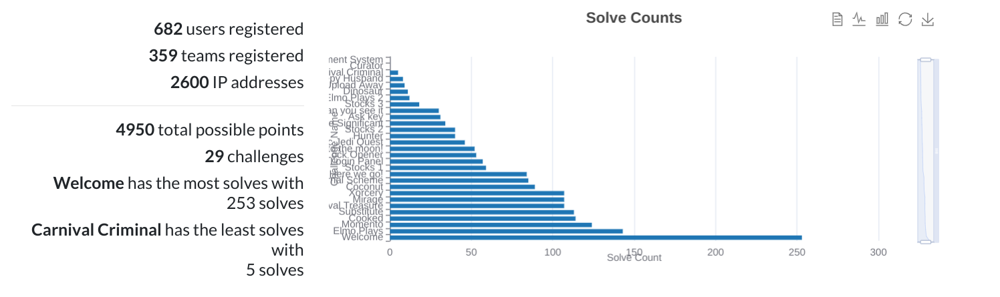

<h1 align="center">
    
    
        Cyber Security Club
    
</h1>

<h3 align="center">Securing the digital world, One byte at a time</h3>

# ApoorvCTF-23-Writeups

This is a repository for all the writeups of ApoorvCTF 2024. Each challenge has its writeups in its respective README
file along with its description.\
src/ has the source code for the challenge\
files/ if present, has the files that're given with the challenge\

#### Flag Format

`apoorvctf{some_text_here}`

### Winners:

1. Team 0xUnr34l - 4950pts
2. Team broski - 4950pts
3. Team pattu_sai - 4750 pts

Special mentions:

4. Team shadow_braker - 4450pts
5. Team kick_buttowski - 4450pts

### Stats

