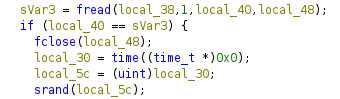
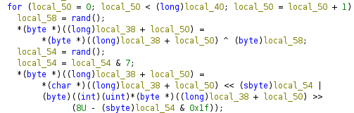

# Elmo plays 2

300 points

Author - helix

### Description
Elmo strikes again, this time hitting our flag storage server
by using a mysterious algorithm called cookieware.
Can you help in recovering the original data?

flag - apoorvctf{elm0_w1ll_r3turn_aga1n}


## Writeup

Upon decompiling the binary in ghidra,we can observe it is
reading a target file  to select the offset at which to start encrypting data using fseek. It also generates a random seed based on the current time and initializes the random number generator using srand



The seed is written in flag.enc, we just need to extract it with fread and run the same bitwise shift arithmetic in reverse to decrypt the data.



Here is the code to decrypt the flag.enc


```c
#include <stdio.h>
#include <stdlib.h>
#include <stdint.h>

typedef unsigned char byte;

int main(void) {
    int key;
    uint32_t seed;
    uint32_t shift;
    long i;
    FILE *file;
    size_t file_bytes;
    byte *alloc_bytes;
    FILE *new;

    file = fopen("flag.enc", "rb");
    fread(&seed, 1, 4, file);
    srand(seed);
    fseek(file, 0, 2);

    file_bytes = ftell(file) - 4;
    fseek(file, 4, 0);
    alloc_bytes = malloc(file_bytes);

    fread(alloc_bytes, file_bytes, 1, file);
    fclose(file);


   for (i=0; i < file_bytes; i++) {

       key = rand();
       shift = rand();
       shift = shift & 7;

       alloc_bytes[i] = (alloc_bytes[i] >> shift) | (alloc_bytes[i] << (8 - shift));
       alloc_bytes[i] = alloc_bytes[i] ^ key;
   }

   new = fopen("flag.dec", "wb");
   fwrite(alloc_bytes,1,file_bytes,new);
   fclose(new);
   free(alloc_bytes);

   return 0;
}

```


