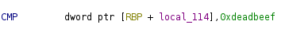
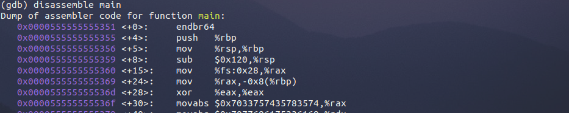
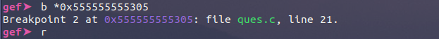
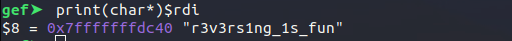

# Lock Opener

Name - Lock Opener

Points - 200

Author - helix

### Description

"I forgot the key to my lock,it is here in this file somewhere.
Can you reverse your way to get the key ?"

Enclose the key with apoorvctf{...}

hint : Do you have the addr

flag : apoorvctf{r3v3rs1ng_1s_fun}

## Writeup

We need to decompile the given binary. Lets use ghidra for the task.
A lot of stuff is going on in the main function. We can observe that user input is
being stored in local_e8 which then is then being converted to its
integer equivalent in base 10 using the strtol function.

If we look at the assembly, we can see that its value is being compared to 0xdeadbeef.

If the first check passes then a call goes out to cmp function.
There is a hardcoded string local_108 in cmp function which is being passed to enc func.

Upon inspecting we can see that a loop is decrementing each character pointed to by local_10
by 2. The user second input is being compared to this modified string using strcmp which is in fact the key itself.

In order to get the key, we can use GDB to perform dynamic analysis.

Lets boot up the binary inside GDB and disassemble the main

We can find the address where our first check is happening, similarly lets diassemble "cmp" function. We need to dump the arguments of the strcmp function and for that we need to set a breakpoint at the address where strcmp is called and then examine the arguments.

We can then set a breakpoint at this address to pause the execution just before the string comparison takes place.

Lets run the binary, it will halt at this breakpoint. Now we can dump the arguments to view the key.

