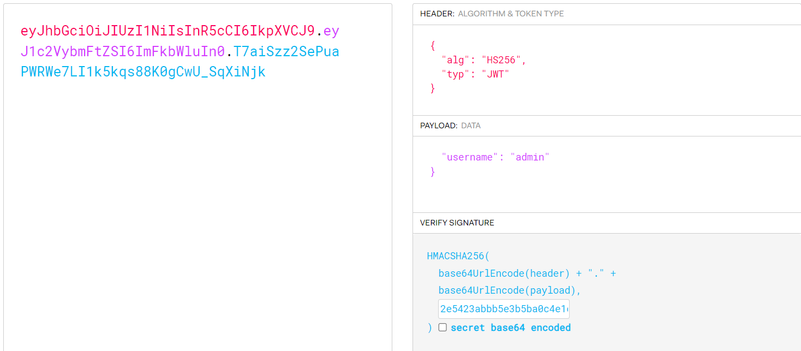

## Description

Oh no! Here we go again, yet another login panel - like the authors just couldn't think of anything else.

Author: errorxyz\
Points: 200

## Writeup

1. Analyzing the source for login.html, we see a weird value: 2e5423abbb5e3b5ba0c4e1c65608f5ad. We'll note it down.
1. Analyzing the login() function, we see that test:test should log us in.
1. Upon logging in we are assigned a seemingly weird cookie.
1. Analyzing the source code, we see that it is something called a json web token(JWT). Read more about how jwt works [here](https://jwt.io/introduction)
1. Go to jwt.io to parse your jwt. Paste it on the input box.
1. Analysing app.py, we see that that dashboard() function validates our cookie
1. We see that cookies are validated using two algorithms RS256 and HS256
1. HS256 uses a single key to both encrypt and decrypt, while RS256 uses public, private keys to do the same.
1. HS256 uses a 256 bit and the string we found earlier is 32 chars i.e 256 bits, so it could possibly be the secret key for HS256.
1. On jwt.io, change alg from "RS256" to "HS256" and change username from "test" to "admin"
1. Now put our newly found secret key in the secret key field to get our new JWT on the left pane.

1. Change your cookie to this JWT and access /dashboard/admin to view the flag.

flag: ApoorvCTF{5eCr3t5_AreNT_SECrEt_ANYMore}
